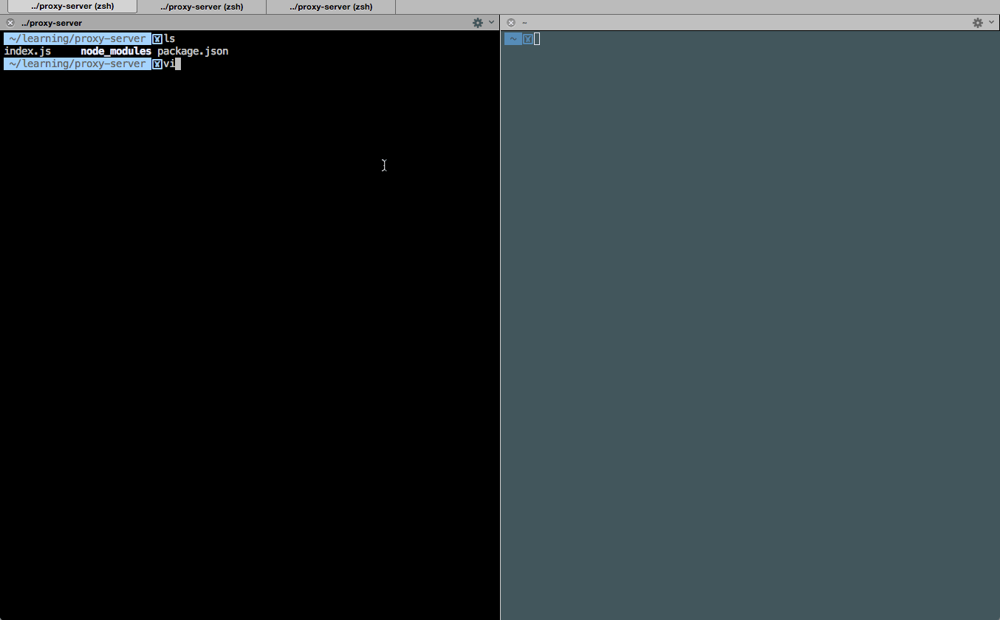

# Proxy Server

This is a Proxy Server for Node.js submitted as the [pre-work](http://courses.codepath.com/snippets/intro_to_nodejs/prework) requirement for CodePath.

Time spent: 4hrs

Completed:

* [*] Required: Requests to port `8000` are echoed back with the same HTTP headers and body
* [*] Required: Requests/reponses are proxied to/from the destination server
* [*] Required: The destination server is configurable via the `--host`, `--port`  or `--url` arguments
* [*] Required: The destination server is configurable via the `x-destination-url` header
* [*] Required: Client requests and respones are printed to stdout
* [*] Required: The `--logfile` argument outputs all logs to the file specified instead of stdout
* [] Optional: The `--exec` argument proxies stdin/stdout to/from the destination program
* [] Optional: The `--loglevel` argument sets the logging chattiness
* [] Optional: Supports HTTPS
* [*] Optional: `-h` argument prints CLI API

Walkthrough Gif:
[Add walkthrough.gif to the project root]



## Starting the Server

```bash
nodemon index.js --host=google.com --logfile=log.txt
```

## Features

### Echo Server:
Port 8000 will echo back the request

```bash
curl http://127.0.0.1:8000/somepath -d 'hello world' -H 'foo: bar' -v
*   Trying 127.0.0.1...
* Connected to 127.0.0.1 (127.0.0.1) port 8000 (#0)
> POST /somepath HTTP/1.1
> Host: 127.0.0.1:8000
> User-Agent: curl/7.43.0
> Accept: */*
> foo: bar
> Content-Length: 11
> Content-Type: application/x-www-form-urlencoded
>
* upload completely sent off: 11 out of 11 bytes
< HTTP/1.1 200 OK
< host: 127.0.0.1:8000
< user-agent: curl/7.43.0
< accept: */*
< foo: bar
< content-length: 11
< content-type: application/x-www-form-urlencoded
< Date: Mon, 07 Mar 2016 07:39:37 GMT
< Connection: keep-alive
<
* Connection #0 to host 127.0.0.1 left intact
hello world%
```

### Proxy Server:

Port 9000 will proxy to the echo server on port 8000.

```bash
curl http://127.0.0.1:9000/somepath -d 'hello world' -H 'foo: bar' -H 'x-destination-url: 127.0.0.1:8000' -v
*   Trying 127.0.0.1...
* Connected to 127.0.0.1 (127.0.0.1) port 9000 (#0)
> POST /somepath HTTP/1.1
> Host: 127.0.0.1:9000
> User-Agent: curl/7.43.0
> Accept: */*
> foo: bar
> x-destination-url: 127.0.0.1:8000
> Content-Length: 11
> Content-Type: application/x-www-form-urlencoded
>
* upload completely sent off: 11 out of 11 bytes
< HTTP/1.1 200 OK
< host: 127.0.0.1:8000
< user-agent: curl/7.43.0
< accept: */*
< foo: bar
< x-destination-url: 127.0.0.1:8000
< content-length: 11
< content-type: application/x-www-form-urlencoded
< connection: close
< date: Mon, 07 Mar 2016 07:39:18 GMT
<
* Closing connection 0
hello world%
```

### Configuration:

#### CLI Arguments:

The following CLI arguments are supported:

##### `--host`

The host of the destination server. Defaults to `127.0.0.1`.

##### `--port`

The port of the destination server. Defaults to `80` or `8000` when a host is not specified.

##### `--logfile`

Specify a file path to redirect logging to.

#### Headers

The follow http header(s) are supported:

##### `x-destination-url`

Specify the destination url on a per request basis. Overrides and follows the same format as the `--url` argument.